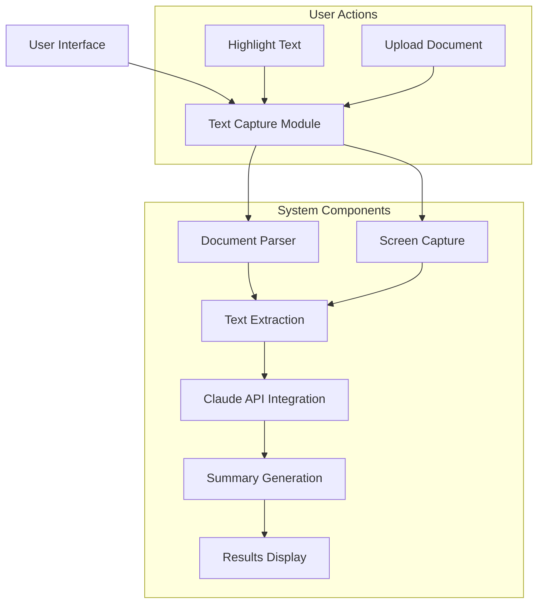

```mermaid
flowchart TD
    A[User Interface] --> B[Text Capture Module]
    B --> C[Document Parser]
    B --> D[Screen Capture]
    C --> E[Text Extraction]
    D --> E
    E --> F[Claude API Integration]
    F --> G[Summary Generation]
    G --> H[Results Display]
    
    subgraph "User Actions"
    I[Highlight Text] --> B
    J[Upload Document] --> B
    end
    
    subgraph "System Components"
    B
    C
    D
    E
    F
    G
    H
    end
```
